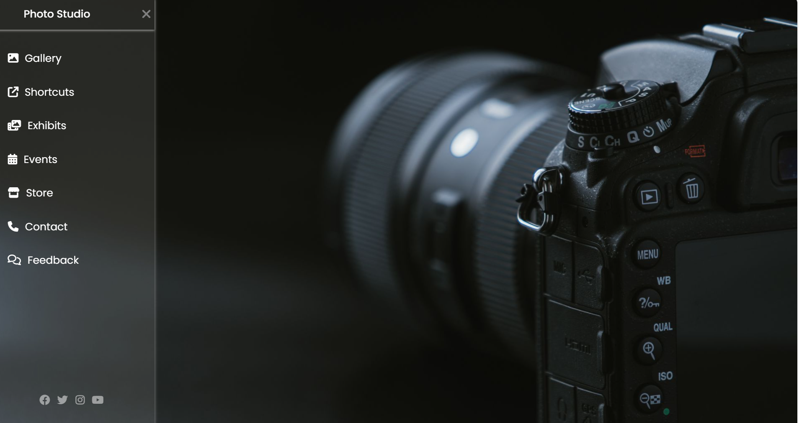

# 📸 Photo Studio Website

A modern, responsive **Photo Studio website** designed using HTML and CSS. This project includes a stylish sidebar navigation menu with icons, smooth transitions, and social media links — perfect for a photography portfolio or a photo business landing page.

## 🖼️ Preview

 

---


## 🚀 Features

- Responsive Sidebar Menu
- Font Awesome Icons
- Google Fonts - Poppins
- Modern Layout
- Social Media Links

---

## 🛠️ Built With

| Frontend | Tools / Libraries |
|----------|-------------------|
| HTML5    | Font Awesome      |
| CSS3     | Google Fonts      |

---

## 📂 Project Structure
```text
photo-studio-website/
│
├── index.html # Main HTML page
├── style.css # Custom styling
├── README.md # Project description
└── screenshot.png # (Optional) preview image
```
## Author
Anuj Singal

